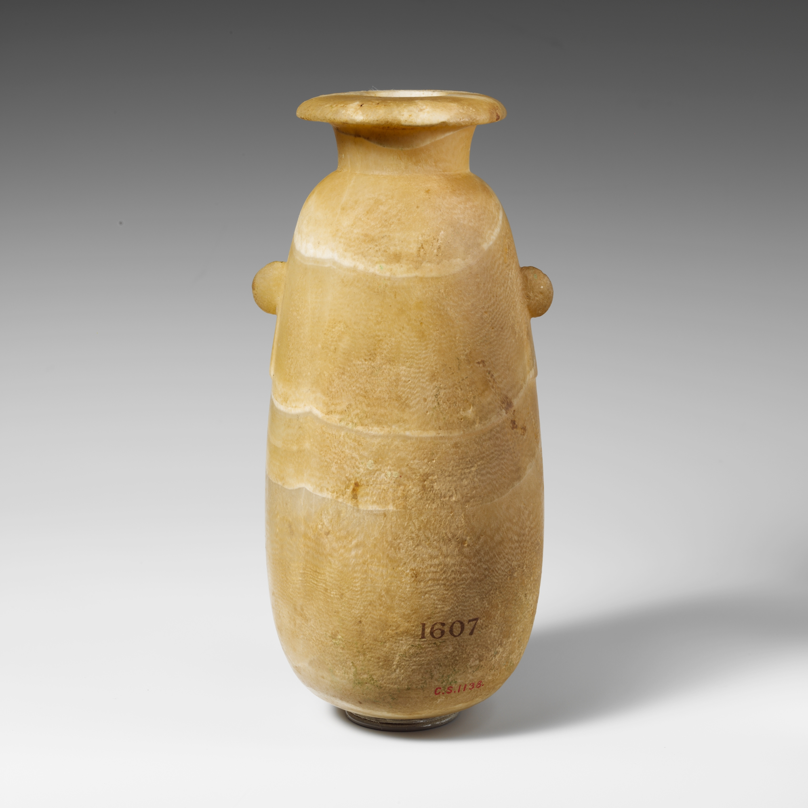
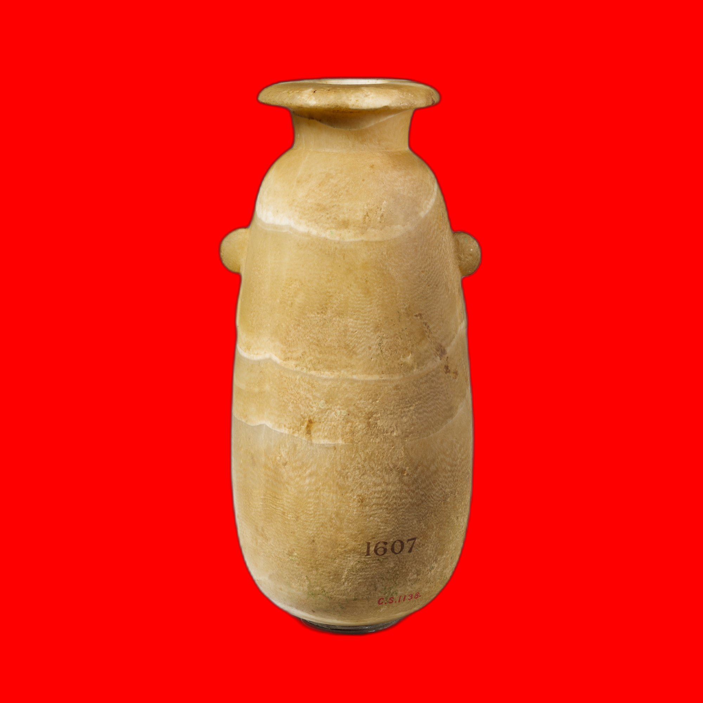

# BG Studio CLI

[](https://opensource.org/licenses/MIT)
[](https://www.python.org/downloads/)
[](https://github.com/MichailSemoglou/bg-studio-cli/issues)
[](https://github.com/MichailSemoglou/bg-studio-cli/stargazers)

A powerful command-line tool for intelligent background removal from images using the `rembg` library with advanced masking controls and post-processing techniques.

## Features

- **Multiple AI Models**: Choose from 5 different pre-trained models optimized for different scenarios
- **Advanced Post-Processing**: Noise reduction, edge smoothing, and contrast enhancement
- **Custom Backgrounds**: Replace transparency with solid colors, gradients, or custom images
- **Edge Blending**: Natural-looking soft edges for professional results
- **Batch Processing**: Process multiple images efficiently
- **Command Line Interface**: Easy-to-use CLI with extensive options
- **High-Quality Output**: PNG/JPG support with transparency preservation

## Example

Here's a real-world example of background removal with a custom background color:

**Original Image:**



**Processed with Red Background (#FF0000):**



_Alabaster alabastron, 5th–4th century B.C., Cyprus._

```bash
# Command used to create this result:
python bgstudio.py alabaster-alabastron.jpg -b "#FF0000" -o alabaster-alabastron-red.png
```

## Quick Start

### Option 1: Clone and Install

```bash
git clone https://github.com/MichailSemoglou/bg-studio-cli.git
cd bg-studio-cli
python3 -m venv venv
source venv/bin/activate  # On macOS/Linux or venv\Scripts\activate on Windows
pip install -r requirements.txt
```

### Option 2: Direct Download

```bash
wget https://raw.githubusercontent.com/MichailSemoglou/bg-studio-cli/main/bgstudio.py
pip install rembg pillow numpy onnxruntime
```

### Basic Usage

```bash
python bgstudio.py your_image.jpg
```

## Installation

### Prerequisites

- Python 3.8 or higher
- pip package manager

### Step-by-step Installation

1. **Clone the repository**

   ```bash
   git clone https://github.com/MichailSemoglou/bg-studio-cli.git
   cd bg-studio-cli
   ```

2. **Create virtual environment (recommended)**

   ```bash
   python3 -m venv venv
   source venv/bin/activate  # On macOS/Linux
   # or
   venv\Scripts\activate     # On Windows
   ```

3. **Install dependencies**

   ```bash
   pip install -r requirements.txt
   ```

4. **Verify installation**
   ```bash
   python bgstudio.py --version
   ```

## Usage

### Command Line Interface

```bash
python bgstudio.py [INPUT] [OPTIONS]
```

### Basic Examples

```bash
# Remove background with default settings
python bgstudio.py photo.jpg

# Specify output file
python bgstudio.py photo.jpg -o result.png

# Use human-optimized model for portraits
python bgstudio.py portrait.jpg -m u2net_human_seg

# Add white background
python bgstudio.py photo.jpg -b white

# Process without showing result window
python bgstudio.py photo.jpg --no-show
```

### Advanced Examples

```bash
# Custom hex color background
python bgstudio.py photo.jpg -b "#FF5733" -o orange_bg.jpg

# Soft edges with blur
python bgstudio.py photo.jpg --blur 2.5

# Fast processing (skip post-processing)
python bgstudio.py photo.jpg --no-postprocess

# Verbose output with custom RGB background
python bgstudio.py photo.jpg -b "255,87,51" -v
```

### Command Line Options

| Option             | Description           | Example                      |
| ------------------ | --------------------- | ---------------------------- |
| `INPUT`            | Input image file path | `photo.jpg`                  |
| `-o, --output`     | Output file path      | `-o result.png`              |
| `-m, --model`      | AI model to use       | `-m u2net_human_seg`         |
| `-b, --background` | Background color/type | `-b white` or `-b "#FF0000"` |
| `--blur`           | Edge blending radius  | `--blur 2.5`                 |
| `--no-postprocess` | Skip post-processing  | `photo.jpg --no-postprocess` |
| `--no-show`        | Don't display result  | `photo.jpg --no-show`        |
| `-v, --verbose`    | Detailed output       | `photo.jpg -v`               |
| `--list-models`    | Show available models | `--list-models`              |
| `--version`        | Show version          | `--version`                  |

### Background Options

| Value                  | Result                       | Example              |
| ---------------------- | ---------------------------- | -------------------- |
| `transparent`          | Transparent background (PNG) | Default              |
| `white`                | White background             | `-b white`           |
| `black`                | Black background             | `-b black`           |
| `red`, `green`, `blue` | Named colors                 | `-b red`             |
| `#RRGGBB`              | Hex color codes              | `-b "#FF5733"`       |
| `R,G,B`                | RGB values                   | `-b "255,87,51"`     |
| `R,G,B,A`              | RGBA values                  | `-b "255,87,51,128"` |

## Available AI Models

| Model               | Best For          | Speed     | Quality   | Use Case                       |
| ------------------- | ----------------- | --------- | --------- | ------------------------------ |
| `u2net`             | General purpose   | Fast      | High      | Default choice for most images |
| `u2net_human_seg`   | People, portraits | Fast      | Very High | Best for human subjects        |
| `u2netp`            | Quick processing  | Very Fast | Good      | When speed is priority         |
| `isnet-general-use` | High accuracy     | Slow      | Very High | Maximum quality results        |
| `silueta`           | Clear silhouettes | Fast      | High      | Objects with defined edges     |

### Model Selection Guide

```bash
# For portraits and people
python bgstudio.py portrait.jpg -m u2net_human_seg

# For products and objects
python bgstudio.py product.jpg -m silueta

# For maximum quality (slower)
python bgstudio.py image.jpg -m isnet-general-use

# For batch processing (faster)
python bgstudio.py image.jpg -m u2netp --no-postprocess
```

## API Reference

The tool can also be used as a Python library:

```python
from bgstudio import enhanced_background_removal, blend_edges, create_custom_background

# Basic usage
result = enhanced_background_removal('input.jpg', 'output.png')

# With custom model and post-processing
result = enhanced_background_removal(
    'input.jpg',
    'output.png',
    model='u2net_human_seg',
    apply_postprocessing=True
)

# Apply additional effects
result = blend_edges(result, blur_radius=2)
result = create_custom_background(result, (255, 255, 255, 255))
result.save('final_output.jpg')
```

### Core Functions

| Function                        | Purpose                  | Parameters                                                   |
| ------------------------------- | ------------------------ | ------------------------------------------------------------ |
| `enhanced_background_removal()` | Main processing function | `input_path`, `output_path`, `model`, `apply_postprocessing` |
| `post_process_mask()`           | Improve mask quality     | `original_img`, `masked_img`                                 |
| `create_custom_background()`    | Add solid background     | `img`, `background_color`                                    |
| `blend_edges()`                 | Soften edges             | `img`, `blur_radius`                                         |
| `parse_background_color()`      | Parse color strings      | `color_str`                                                  |

- `img`: PIL Image to process
- `blur_radius`: Blur intensity (1-5 recommended)

## Tips for Better Results

### 1. Choose the Right Model

- **For people/portraits**: Use `u2net_human_seg`
- **For objects with clear edges**: Use `silueta`
- **For general images**: Use `u2net` or `isnet-general-use`
- **For speed**: Use `u2netp`

### 2. Image Quality Tips

- Use high-resolution images for better results
- Ensure good contrast between subject and background
- Avoid cluttered backgrounds when possible
- Good lighting helps model accuracy

### 3. Post-Processing Adjustments

```python
# For sharper edges
enhancer = ImageEnhance.Contrast(alpha_channel)
sharp_alpha = enhancer.enhance(1.5)  # Increase for sharper edges

# For softer edges
soft_result = blend_edges(result, blur_radius=3)  # Increase for softer edges

# For noise reduction
# Increase MedianFilter size for more noise reduction
alpha_filtered = alpha_pil.filter(ImageFilter.MedianFilter(size=5))
```

## Common Issues & Solutions

### Issue: "No module named 'onnxruntime'"

**Solution:** Install onnxruntime:

```bash
pip install onnxruntime
```

### Issue: Poor edge quality

**Solutions:**

- Try different models (u2net_human_seg for people)
- Adjust blur_radius in blend_edges()
- Increase contrast enhancement value

### Issue: Background not fully removed

**Solutions:**

- Try isnet-general-use model for higher accuracy
- Ensure good contrast in original image
- Use post-processing with higher contrast enhancement

### Issue: Image too dark/bright after processing

**Solution:** Adjust the original image brightness before processing or modify the alpha channel processing parameters.

## Output Formats

- **PNG**: Preserves transparency, larger file size
- **JPG**: Requires background color, smaller file size

## Examples

```python
# Human portrait with soft edges
result = enhanced_background_removal('portrait.jpg', 'person.png', model='u2net_human_seg')
result = blend_edges(result, blur_radius=2)

# Object with sharp edges
result = enhanced_background_removal('product.jpg', 'product.png', model='silueta')

# Quick processing
result = enhanced_background_removal('image.jpg', 'output.png', model='u2netp', apply_postprocessing=False)
```

## Performance Benchmarks

| Image Type       | Model           | Processing Time\* | Quality Score\*\* |
| ---------------- | --------------- | ----------------- | ----------------- |
| Portrait (1080p) | u2net_human_seg | 2.3s              | 9.5/10            |
| Product (1080p)  | silueta         | 1.8s              | 9.2/10            |
| General (1080p)  | u2net           | 2.1s              | 8.8/10            |
| Batch (1080p)    | u2netp          | 1.2s              | 8.5/10            |

\*Tested on MacBook Pro M1, \*\*Subjective quality assessment

## Contributing

We welcome contributions! Here's how to get started:

1. **Fork the repository**
2. **Create a feature branch**
   ```bash
   git checkout -b feature/amazing-feature
   ```
3. **Make your changes**
4. **Add tests if applicable**
5. **Commit your changes**
   ```bash
   git commit -m "Add amazing feature"
   ```
6. **Push to your branch**
   ```bash
   git push origin feature/amazing-feature
   ```
7. **Open a Pull Request**

### Development Setup

```bash
git clone https://github.com/MichailSemoglou/bg-studio-cli.git
cd bg-studio-cli
python -m venv venv
source venv/bin/activate
pip install -r requirements.txt
pip install -r requirements-dev.txt  # If you create development dependencies
```

## Bug Reports

Found a bug? Please create an issue with:

- **Description**: What happened?
- **Expected behavior**: What should have happened?
- **Steps to reproduce**: How can we reproduce the issue?
- **Environment**: OS, Python version, etc.
- **Images**: Sample images (if applicable)

## Feature Requests

Have an idea? We'd love to hear it! Please create an issue with:

- **Feature description**: What would you like to see?
- **Use case**: Why would this be useful?
- **Proposed implementation**: Any ideas on how to implement it?

## License

This project is licensed under the MIT License - see the [LICENSE](LICENSE) file for details.

### Third-Party Licenses

This project uses the following open-source libraries:

- **rembg**: Apache License 2.0
- **Pillow**: PIL Software License
- **NumPy**: BSD License
- **ONNX Runtime**: MIT License

## Acknowledgments

- Thanks to the [rembg](https://github.com/danielgatis/rembg) team for the amazing background removal models
- Inspired by various image processing techniques and community feedback
- Special thanks to all contributors and users who help improve this tool

## Support

- **Documentation**: Check this README and inline code comments
- **Issues**: [GitHub Issues](https://github.com/MichailSemoglou/bg-studio-cli/issues)
- **Discussions**: [GitHub Discussions](https://github.com/MichailSemoglou/bg-studio-cli/discussions)

---

**Made by [Michail Semoglou](https://github.com/MichailSemoglou)**

_If this tool helped you, please consider starring the repository!_
